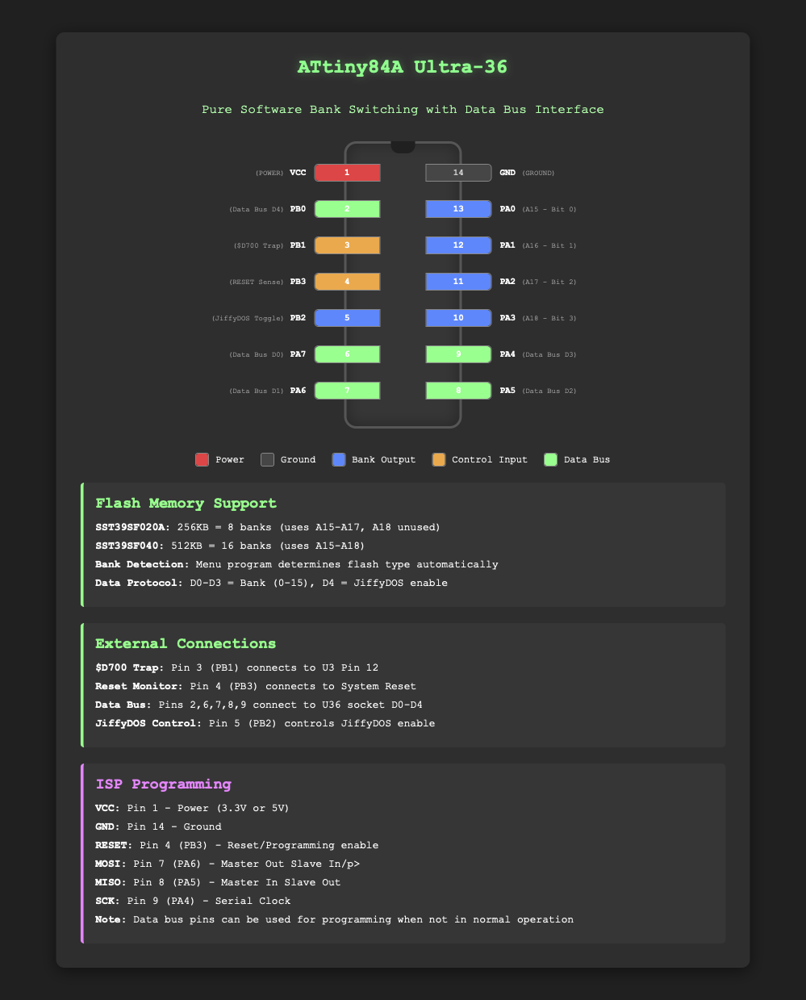

```
//   _____  ___________              _______________
//   __  / / /__  /_  /_____________ __|__  /_  ___/
//   _  / / /__  /_  __/_  ___/  __ `/__/_ <_  __ \ 
//   / /_/ / _  / / /_ _  /   / /_/ /____/ // /_/ / 
//   \____/  /_/  \__/ /_/    \__,_/ /____/ \____/  
// Ultra-36 Rom Switcher for Commodore 128 - ATTiny84A Frimware
// Free for personal use.
// Commercial use or resale (in whole or part) prohibited without permission.
// (c) 2025 Lukasz Dziwosz / LukasSoft. All Rights Reserved.
```
# Ultra36Tiny84Firmware

Ultra-36Tiny84Firmware is the companion microcontroller firmware for the Ultra-36 internal ROM selector for Commodore 128 U36 Rom socket. It runs on an ATtiny84A and is responsible for bank switching, JiffyDOS toggling, and persistent state management via I/O lines.

This firmware enables runtime selection between 8–16 ROM banks stored on SST39SF020A or SST39SF040 Flash chips. It communicates with the C128 via a trap mechanism ($D700) and reads the system RESET line to allow soft return to the Menu ROM.

## 📂 Project Structure
```
Ultra36Tiny84Firmware/
├── ultra36/             # Arduino sketch folder
│   └── ultra36.ino      # Main firmware source code
└── .git/                # Git repo for version control
```
## 🧰 Requirements
    •    ATtiny84A microcontroller (DIP-14)
    •    SST39SF020A (256K) or SST39SF040 (512K) Flash EPROM
    •    Arduino IDE (for compiling and uploading)
    •    USBasp or similar ISP programmer

## 🚀 Features
    •    Supports 8 ROM banks (SST39SF020A) or 16 banks (SST39SF040)
    •    EEPROM bank control via A15–A18 lines
    •    Reads $D700 trap line (U3 pin 12 on C128) for runtime commands
    •    Reads RESET line to detect long-press and auto-return to Menu
    •    Single shared line to toggle JiffyDOS for C64/C128
    •    Bank and Jiffy state stored in EEPROM for persistence
    •    Set Flash type via config.h file

## 🛠️ Pin Usage (ATtiny84A)


## 🔧 Programming & Upload

    1.    Connect a USBasp programmer to the ATtiny84A (MISO/MOSI/SCK/RESET/GND/VCC).
    2.    In Arduino IDE:
    •    Select Board: ATtiny24/44/84 (No bootloader)
    •    Processor: ATtiny84
    •    Clock: 8 MHz (Internal)
    •    Programmer: USBasp
    3.    Open ultra36.ino from the ultra36/ folder.
    4.    Upload the firmware via Sketch > Upload Using Programmer.

## 🧠 How It Works
    •    Sets A15–A18 accordingly based on the last saved bank number.
    •    Monitors $D700 trap pin for bank switching commands.
    •    Monitors the C128 RESET line for long hold (3s) → switches back to menu (bank 0).
    •    JiffyDOS toggle line is shared and activated on command.

📦 GitHub

This firmware lives in:

👉 [Ultra36Tiny84Firmware](https://github.com/LukaszDziwosz/Ultra36Tiny84Firmware)

It pairs with the C128 menu ROM project:

👉 [Ultra36MenuRom](https://github.com/LukaszDziwosz/Ultra36MenuRom)

⸻

🧑‍💻 Credits

Designed for the Ultra-36 internal ROM selector project for the Commodore 128.

Hardware design by Jim Brain. Software by Lukasz Dziwosz.
